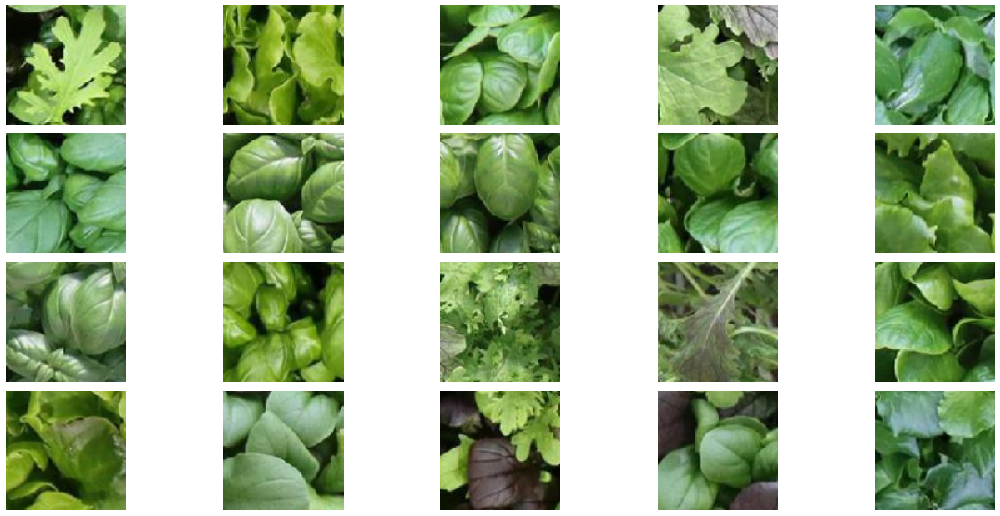
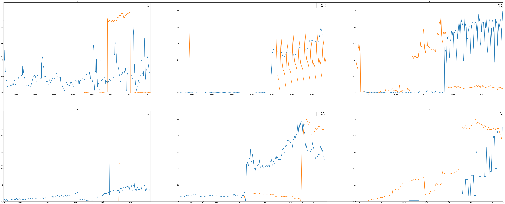

# Artificial Neural Networks and Deep Learning - AY 2023/2024

 The challenges for the course "Artificial Neural Networks and Deep Learning" for the AY 2023/2024 were centered on:
 1. Image Classification
 2. Time Series Forecasting

 In both challenges, our team was awarded the maximum grade of **5.5/5**

## Challenge 1: Image Classification

	

In this challenge, the goal was to train a classifier to correctly predict whether an image represented a **healthy** or **unhealthy** plant.
We focused on three different paradigms to find the best solution:
- Custom CNNs (S-Net)
- Transfer Learning + Fine Tuning of Pre-trained models
- Self-Supervised Learning and Ensemble models

All of which yielded notable results, specifically **Transfer Learning** + **Fine-Tuning** turned out to be the best formula for this type of problem.

Moreover, because the provided dataset only consisted of 5004 images, **Data augmentation** was a critical part of this challenge. For this reason, we developed a custom augmentation pipeline which included:
 - Random Flips
 - Random Translations
 - Random Rotations
 - Random Zoom
 - Random Brightness
 - Random Crop
 - *Custom* Random Perspective Skew
 - CutMix/Mixup

 Additional care was given to finding the best parameters, to prevent augmentations from **cutting-out** pixels that contained valuable information for the classification task.

 For a more in-depth overview of the challenge, methods, and models built, please refer to the **[report](/docs/Report_Challenge_1.pdf)** and the **[notebooks](/notebooks/Challenge%201/)**.

 ### Results

 Our best model achieved a test-set accuracy of **0.8710**, placing our team in the **top 10%** among over 580 participants.

 ## Challenge 2: Time Series Forecasting
 

 	
 

 In this challenge, the goal was to train a model to correctly predict future timesteps of a given time series. The amount of time steps to predict varied between Development and Final phases, increasing from 9 to 18.

 This time, using pre-trained models was not allowed, thus our focus shifted to a different set of approaches:
 - Adapting SOTA models in TS Forecasting
 - Custom RNN architectures (using LSTMs, GRUs)
 - Transformer architectures
 - Model Ensembles

 All of these yielded notable results, specifically **Model Ensembles** of GRU and *Dlinear* (Transformer-based model) proved to be the most effective of the approaches presented.

 The dataset provided consisted of significantly more data points, totaling at 48000 Time series of variable length. This data came with a set of critical issues, among which:
 - Scarcity of some classes compared to others
 - TS already normalized in the range [0,1]
 - Lack of information on: Data sampling, Temporal scale, etc.

 These issues proved difficult to work with because we had no prior information on any signal: for this reason we had no working criteria to remove potential outlier signals.

  In some cases, signals would show imperfections (clipping, spikes) in some portions, while being perfectly fine in others. To see if something could be done about this, we tried plotting correlations/autocorrelations between signals, but even though we managed to detect and remove some outliers, this did not prove to be beneficial for our model.

 Thus, we settled on analyzing *windows* obtained by cutting the signals to 200 points, and concluded that the only windows worth removing were the ones containing long flat trends.

 For a more in-depth overview of the challenge, methods, and models built, please refer to the **[report](/docs/Report_Challenge_2.pdf)** and the **[notebooks](/notebooks/Challenge%202/)**.

 ### Results

 Our best model achieved a test-set MSE of **0.01051**, placing our team in the **top 30%** among over 580 participants.

 ## Team Members

 Team: [Drip Mac](http://chrome.ws.dei.polimi.it/images/thumb/d/d8/ThePoint.jpg/350px-ThePoint.jpg)
 

 [Leonardo Brusini](https://github.com/LeonardoBrusini)
 

 [Marco Scarpelli](https://github.com/ScarpMarc)

 [Davide Tenedini](https://github.com/DavideTenediniPoliMi)

 [Federico Toschi](https://github.com/ftoschi14)
